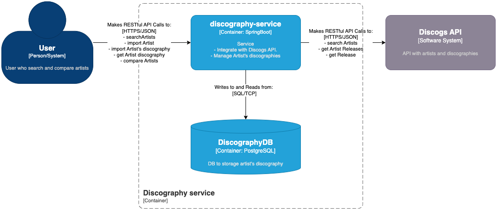
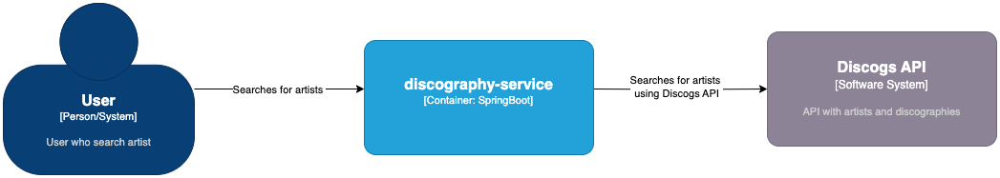
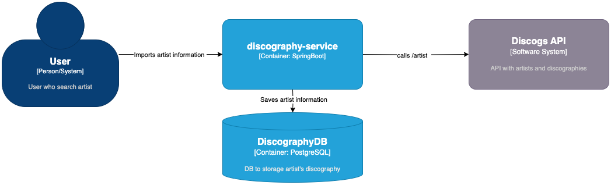
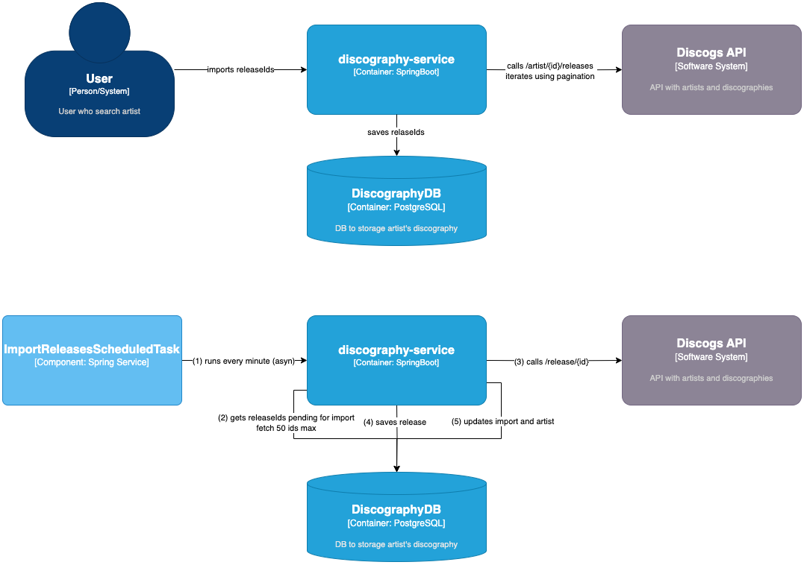
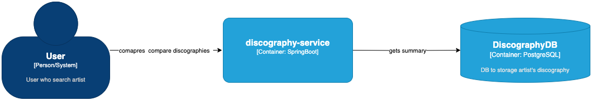

# Discography service

# Technological stack

- Java 21 
- Maven 3.9.6
- Spring Boot 3.4.1
- JPA 
- Docker & Docker compose
- Jacoco
- Junit 5
- Lombok
- Postgres 16
- Swagger 
- Flyway
- Intellij IDEA

# Architecture


The Discography service is a web service that integrates with the Discogs API to retrieve and store the discography of an artist.
The service allows users to search for artists, retrieve their discography, 
store the discography in a database and consult the artist's discography from the database.
The image above shows main components of the system and their interactions.

The purposed service use Java 21, Spring Boot 3.4.1, JPA, OkHttp, Docker  Postgres 16 as main technologies.
For the database, the service uses Flyway to manage migrations.


### Main Flows 
- Artist Search: The user searches for an artist by name, and the service queries the Discogs API to retrieve the artist's information.
- Artist and Discography Retrieval: The service retrieves the artist and discography information  of the selected artist from the Discogs API and stores it in a database.
The service imports the discography data from the Discogs API into the database, using a sequence of both synchronous and asynchronous process.
- Artist's Discography: The user can retrieve the discography of an artist from the database sort by year or by title.
- Artist Comparison: The user can compare the discographies of 2 to 5 artists from the database.

### Main architecture and design principles applied:
- Hexagonal architecture (ports and adapters)
- SOLID
- Dependency Inversion Principle
- Separation of Concerns (SoC)

# Flows 
## Search artists by name from Discogs

This flow allows searching for artists by name directly through the Discogs API.

## Import artist from Discogs

This flow allows importing an artist  from the Discogs API into the database.

# Import artist's discography


Given that an artist can have thousands of releases and the Discogs API has a limit of 60 calls per minute, the artist's discography import process is divided into two steps:

- Step 1: Call the resource /artists/{id}/releases from the Discogs API to retrieve the release IDs of the artist.
This step involves retrieving the release IDs of an artist by iterating through their releases using the Discogs API and storing the data in the artist_discography_import and artist_discography_import_details tables in the database.
The service has a limitation regarding the total number of releases an artist can have. This resource only supports importing artists with a maximum of 500 releases. 
This limitation is because the Discogs API Limitations, for example the importation of 500 releases (async process) takes about 9 minutes. 

- Step 2: Import the releases into the database using a scheduled task that runs every minute.
This task queries the IDs pending import from the artist_discography_import_details table, retrieves the release data from the Discogs API, and imports them into the database.
The task processes a maximum of 50 IDs per execution to comply with the Discogs API limit of 60 calls per minute.

## Consult artist's discography

This flow allows retrieving the discography of an artist from the database. Only artists with completed importation are available to be consulted.
The tables artist_discography_import and artist_discography_import_details are used to track to retrieve the release in an efficient way. 


## Compare  artist's discography

This flow allows comparing the discography of 2 up to 5 artists from the database. 
The service returns a list with the summary of each artist's discography, including the total number of releases,
active years, first release year, last release year, genres, and styles.


# API Documentation

The service exposes the following endpoints:

### **GET** `v1/discogs/artists/search?q={query}`
Allows searching for artists by name.

---

### **POST** `v1/artists/import/discogs/{discogsArtistId}`
Imports an artist from the Discogs API into the database.

---

### **POST** `v1/artists/discography/import/discogs/{discogsArtistId}`
Imports the artist's release IDs from the Discogs API into the database.  
This process creates entries in the `artist_discography_import` and `artist_discography_import_details` tables to be processed by the scheduled task.

---

### **GET** `v1/artists/discography/{discogsArtistId}`
Retrieves the discography of an artist from the database.

---

### **POST** `v1/artists/discography/compare`
Compares the discographies of 2 to 5 artists from the database.

---

### [Link to Swagger file with API Documentation](swagger.json)


# Pros and Cons
The proposed service provides a lightweight process to import the discography of an artist. Here are some pros of the solution:

- The solution uses an elegant approach to import the discography, focusing on a simple yet efficient process that incorporates both synchronous and asynchronous operations. 
- By leveraging hexagonal architecture,  the service is modular easy to  test, maintain, and extend, adhering to best practices that enhance code quality.
- The service is scalable and deployable in various environments, such as Docker, Kubernetes, AWS, GCP, Azure, etc.
- The database design supports both efficient storage and retrieval of data.
- The service is built using the Spring Boot framework, providing a robust foundation for developing microservices while following best practices and conventions.
- The service uses JPA, offering a reliable foundation for database management.
- The service is developed with clear segregation of concerns and adheres to SOLID principles, ensuring maintainable and reusable code.

However, the solution could be improved in the future by:

- Creating an independent service to manage the execution of the importation process.
- Developing an independent HTTP client library to handle calls to the Discogs API.
- Adding notifications to inform users when the importation process is completed.
- Configuring rate limits to handle Discogs API restrictions effectively.
- Enhancing the ScheduledTask, exception handling, and retry mechanisms for improved resilience.
- Exploring alternatives to address Discogs API limitations, such as multi-zone deployments.

### TO-DO
Given the complexity of the challenge and some limitations in my available time for the development, 
the solution focuses on the primary requirements, leaving some tasks pending for future implementation, including:

- Completing testing (unit, integration, and system). I have implemented full tests for the "search artist" flow to demonstrate my knowledge and the common practices I follow in my daily work.
- Adding logs to track exceptions in the scheduled task. I created the artist_discography_import_log table for this purpose.
- Creating custom pagination to standardize pagination across all endpoints.
- Deploying the service to a cloud environment such as AWS or Azure.

# Running the service locally
## Prerequisites
- Java 21 or later
- Maven
- Docker and Docker Compose (optional, but recommended)
- Make (optional)

## Properties file
This file contains the configuration of the service such as the database configuration, and consumerKey and consumerSecret for the Discogs API.
For practical reasons, these configurations are included in a properties file. 
In a real environment, it is recommended to use key variables or environment variables to store these configurations outer the git repository.
Consider enable logging at DEBUG level to see more details in the properties file.

## Running the service using maven
If you want to run the service using maven, you need to have a postgres database running.
You can specify the database configuration in the properties file.
```shell
mvn spring-boot:run
```

## Running the service using Docker compose
generate jar

```shell
mvn clean package -DskipTests
```

build the image
```shell
docker build -t leosdev/discography-service:latest .
```
run the containers
```shell
docker-compose up -d  
```
The docker compose file runs  the postgres container and the discography-service container.

to stop the containers
```shell
docker-compose down  
```

## Running the service using Makefile ( mandatory Docker and Make )
Build and run ( internally uses docker compose to run the containers)
```shell
make run  
```

Stop 
```shell
make stop  
```


# Test 
The service has implemented unit tests, integration tests and system tests.
To run tests run the following command
```shell
mvn test 
``` 

### SonarQube
The service is integrated with SonarQube to analyze code quality. To run SonarQube using Docker, execute the following command. This command will start the SonarQube container with the necessary configuration for seamless analysis.
```shell
make run-sonar
```
Given that SonarQube is running locally, the  service could take some time to be ready and also to generate the coverage report.

Once the sonarqube container is ready, to generate the coverage report run the following command.
```shell
mvn verify sonar:sonar
```
 
The report will be available at http://localhost:9000/dashboard?id=discography-service

# Test the service
## Locally
Use curl in command line or an application like Postman.
Also, it is possible to test the service using the Swagger UI ( http://localhost:8080/swagger-ui/index.html )

### CURLs to test the service


#### Search for an artist
```shell
curl --location 'http://localhost:8080/v1/discogs/artists/search?q=Nirvana&page=-2&per_page=30'
```

#### Import an artist
```shell
curl --location --request POST 'http://localhost:8080/v1/artists/import/discogs/570007'
```

#### Import artist releases 
```shell    
curl --location --request POST 'http://localhost:8080/v1/artists/discography/import/discogs/570007'
```

#### Get discography of an artist
```shell
curl --location 'http://localhost:8080/v1/artists/discography/570007'
```

#### Compare discography of 2 artists
```shell
curl --location 'http://localhost:8080/v1/artists/discography/compare' \
--header 'Content-Type: application/json' \
--data '{
"discogsArtistIds":[1434138,30771]
}'

```


## Artists IDs to test
These artist IDs can be used to test different scenarios of the service: 30771, 570007, 125246, 1434138

# Complementary endpoints
- Swagger documentation and Try it out : http://localhost:8080/swagger-ui/index.html
- Sonarqube : http://localhost:9000


